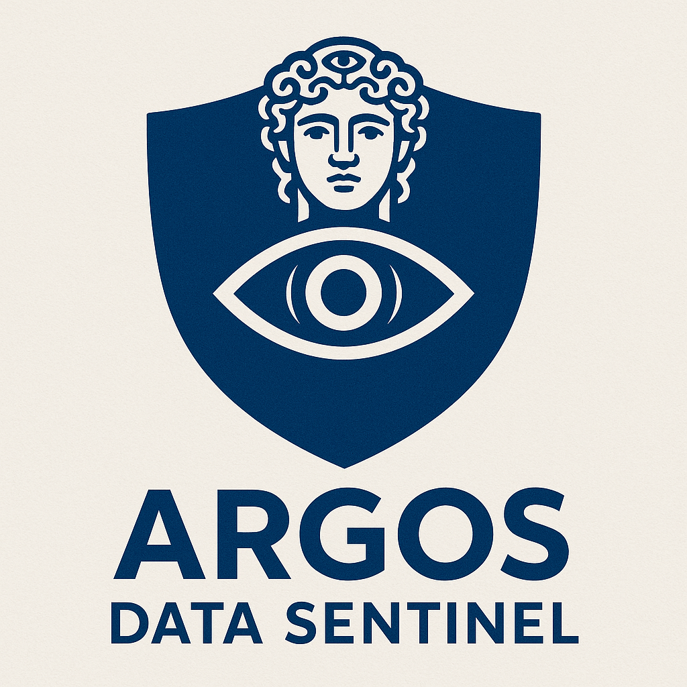

# Argos Data Sentinel

<p align="center">
  
</p>

## 🛡️ Overview
**Argos Data Sentinel** is a modern, intelligent monitoring and observability platform inspired by **Argos Panoptes**, the mythological all-seeing guardian with one hundred eyes. Just like Argos, this system continuously watches over your data pipelines, ensuring transparency, reliability, and security.

> **Mission:** Provide real-time data integrity, anomaly detection, and monitoring for distributed systems.

## ✨ Key Features
- ✅ Real-time data pipeline monitoring
- 🔄 Automated anomaly detection
- 📊 Visual dashboard for data observability
- ⚙️ Integrates with modern data stacks (Python, Airflow, BigQuery, etc.)
- 🚨 Alerts and notifications for abnormal behavior
- 🧠 Adaptive learning for improved alert accuracy

## 🎯 Motivation
In modern data systems, reliability is everything. Data breaks silently. Pipelines fail without warning. Argos Data Sentinel acts as your **all-seeing guardian**, watching every stage and ensuring trust in your data operations.

## 🧱 Architecture (Concept)
```
Data Sources -> Processing Pipelines -> Argos Sentinel -> Alerting & Dashboard
```

## 🚧 Roadmap
- [ ] Publish first open-source beta
- [ ] Add real-time metrics collection
- [ ] Integrate with observability tools
- [ ] Add ML-based anomaly detection
- [ ] Provide Grafana/Prometheus connectors

## 📦 Installation
*(Coming soon when beta releases)*

## 🤝 Contribution
Contributions are welcome! The project follows the **Apache 2.0 License**.

## 📜 License
This project is licensed under the **Apache License 2.0**.

---
Made with 👁️ by the Argos Data Sentinel team

